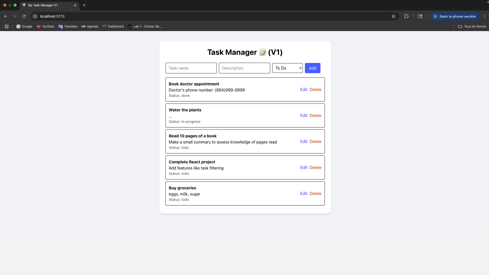

# 📝 Task Manager App (React + TypeScript + Tailwind)

A simple and responsive task manager built with **React**, **TypeScript**, and **Tailwind CSS**. You can add, edit, delete, and filter tasks by status. Tasks are persisted in **localStorage**, so your to-dos stay even after refreshing the page.

---

## 🚀 Features

- ✅ Add new tasks
- ✏️ Edit existing tasks
- ❌ Delete tasks
- 🔄 Filter by status: **To Do**, **In Progress**, **Done**
- 💾 Persistent storage using `localStorage`
- 🎨 Fully styled with Tailwind CSS

---

## 📸 Preview

> _Add a screenshot here after styling is done_


```bash
```

## 🔧 Tech Stack
⚛️ React (Vite)

⛑️ TypeScript

🎨 Tailwind CSS

🗃️ localStorage for persistence

## 🛠️ Getting Started

1. Clone the repo
git clone https://github.com/wesleyajavon/task-manager-react.git
cd task-manager-react

2. Install dependencies
npm install

3. Start the development server
npm run dev

Open http://localhost:5173 to view it in the browser.

